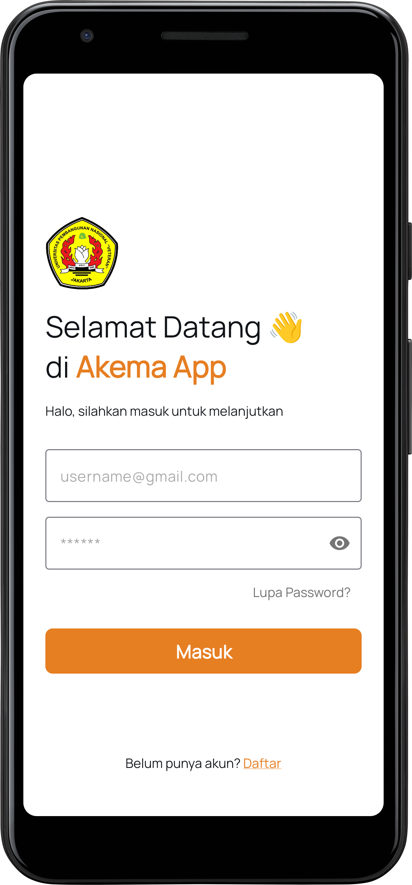
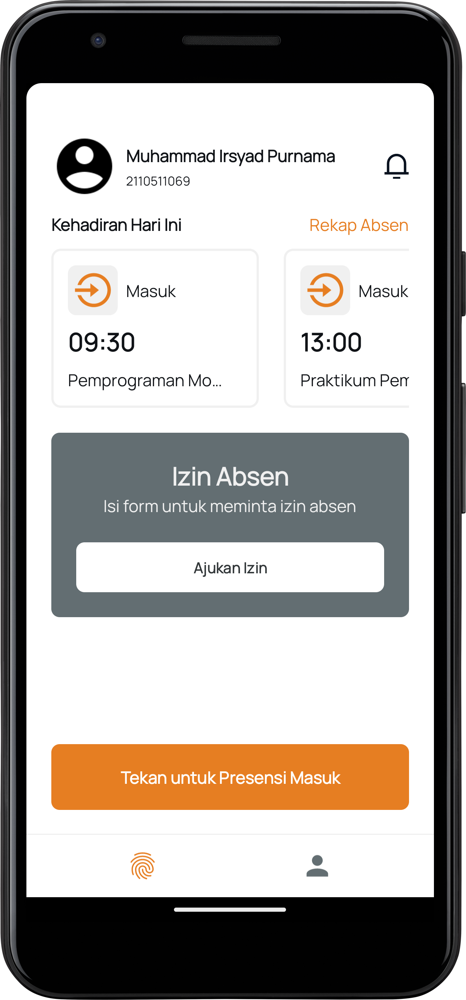

# AKEMA

## About
An Android mobile application for efficient attendance system.

## Installation
To run this application, follow these steps:
1. Clone this repository.
2. Open the project in Android Studio.
3. Connect a device or set up an emulator.
4. Build and run the application.

## Contributing
Contributions are welcome! Please follow these steps:
1. Fork the repository.
2. Create a new branch (`git checkout -b feature/fooBar`).
3. Commit your changes (`git commit -am 'Add some fooBar'`).
4. Push to the branch (`git push origin feature/fooBar`).
5. Create a new Pull Request.

## Screenshots

